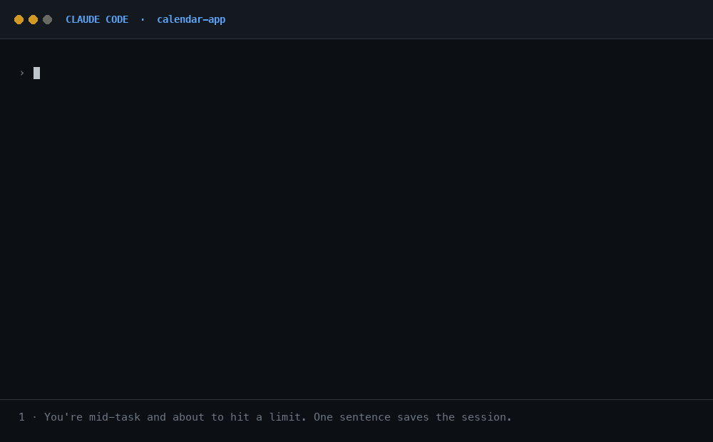
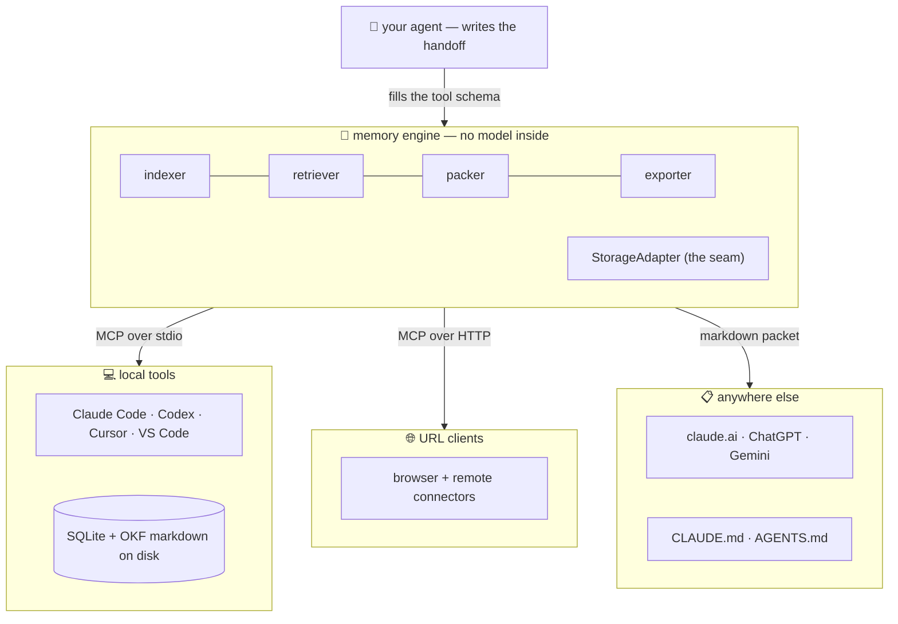

# CtxVault 🔁

**One memory for every AI coding tool on your machine.**

Work in Claude Code. Hit your usage limit. Open Codex, say *"resume"* — and it
already knows your goal, your decisions, what's half-done, and what to do next.
No copy-paste. No re-explaining.



<sub>Every line above is real output from a running CtxVault MCP server — two
separate processes, so the second tool truly starts with no memory of the first.</sub>

> 🔗 **Live playground:** [ctxvault.madebyshubham.in](https://ctxvault.madebyshubham.in/)

---

## The problem

Every AI coding tool forgets everything when you close it.

So you switch tools and paste a wall of transcript. The new tool misreads which
approach you rejected, and confidently rebuilds something you already threw away.

Losing context is annoying. **Badly re-explained context is expensive.**

## How you use it

Two sentences. That's the whole product.

**When you stop working:**

> "save this to ctxvault"

**When you start somewhere else:**

> "resume project myapp from ctxvault"

That's it. Any AI tool that speaks MCP can do both, and they all read the same
memory.

---

## Install

```bash
git clone https://github.com/maskfool/ctxvault && cd ctxvault
npm install
npm run build
node apps/mcp-server/dist/cli.js install all
```

Restart your AI tools. Done.

`ctx install` writes the config for every tool it finds — Claude Code, Claude
Desktop, Cursor, Codex, VS Code. It fills in the correct path for you, so there
is nothing to copy by hand.

It is safe to run: it **merges** into your config instead of replacing it. Other
MCP servers and unrelated settings stay exactly as they were, and the file is
backed up to `<file>.ctxvault-backup` first.

```bash
ctx install claude-code    # or: claude-desktop · cursor · codex · vscode · all
```

**Requirements:** Node 18+ and a C toolchain (macOS: Xcode command line tools),
because SQLite compiles natively.

### Try the handoff

1. In **Claude Code**, do some work, then say *"save this to ctxvault"*
2. In **Codex** (or Cursor, or VS Code), say *"resume project myapp from ctxvault"*

The second tool continues where the first stopped. They never talked to each
other. They just share one folder.

---

## What it works with

One vault at `~/.ctxvault/`, reached three ways. All three run the same six tools
from the same file, so they can never drift apart.

| Your tool | Use | Example |
| --- | --- | --- |
| launches a program | `ctx install` | Claude Code, Cursor, Codex, VS Code, Claude Desktop |
| takes a URL | `ctx serve` | browser clients, sandboxed apps, remote connectors |
| has no MCP at all | `ctx export` | claude.ai, ChatGPT, Gemini |

Most people only ever need the first row.

### Browser and remote clients

Some tools can't launch a program. They want a URL:

```bash
ctx serve                                      # http://127.0.0.1:7077/mcp
ctx serve --token "$(openssl rand -hex 16)"    # require a token
ctx install claude-code --http --token <TOKEN>
```

This is your memory on a port, so the defaults are strict: **localhost only**, an
optional bearer token, and DNS-rebinding protection on. Nothing is exposed to
your network.

For Claude Desktop, add it under **Settings → Connectors → Add custom connector**
(run `ctx install claude-desktop --http` to print the exact values).

### Tools without MCP

```bash
ctx export | pbcopy        # paste into claude.ai, ChatGPT, Gemini
ctx export --to claude     # write a block into CLAUDE.md
ctx export --to agents     # …or AGENTS.md, for Codex
```

The `--to` block sits between markers and is **replaced** every time, never
appended. So `CLAUDE.md` stays a small, current summary instead of growing
forever. Anything outside the markers is untouched.

> **Note:** browser tools like claude.ai and ChatGPT run on someone else's
> servers, so they cannot read your disk. Paste is the only way there — and it
> only goes one direction.

---

## Zero API keys

**CtxVault ships no model and calls no LLM.**

Your agent already lived through the session, so it writes the handoff itself.
The tool's input form *is* the schema it fills in, paid for with tokens you
already spent. Search is keyword-based (SQLite FTS5/BM25) and needs no key
either.

So installing CtxVault adds no API bill, no rate limit, and nothing to configure.

> Want semantic search too? Set one embedding model and search becomes hybrid
> (keywords + vectors). It's an upgrade, never a requirement.

---

## Auto-capture: the save you don't have to remember

There's a hole in *"hit your limit, open another tool, resume"*: saving needs the
agent to have a turn left, and the moment you most need it is the moment it can't
respond.

```bash
ctx hook install     # Claude Code only, for now
```

Claude Code now saves a snapshot right before it drops context, and when a
session ends. It is **model-free** — it stores the tail of your transcript, it
does not summarize. Nothing to fail, nothing to pay for.

You get two layers:

- the **handoff you asked for** — structured and curated, the good record
- the **auto-capture** — raw, but always there

They don't fight each other. An auto-capture is skipped when your handoff already
covers everything in the transcript, so a raw dump can never bury a good summary.
It's also limited to once every 5 minutes per project. Restored auto-captures are
clearly labelled as raw notes, so the next agent knows what it's reading.

```bash
ctx hook status      # when each project was last auto-captured
```

**Still say "save this to ctxvault" when you can.** The hook is a safety net, not
a substitute — a structured handoff is always better than a transcript.

---

## Your memory is just files

Every fact is a markdown file in **OKF (Open Knowledge Format)**, an open
frontmatter-based format for portable agent memory. One fact, one file:

```markdown
---
type: decision
title: Use Intl.DateTimeFormat for timezone display
tags: [timezone, intl-api]
---
Chose Intl.DateTimeFormat over date-fns/moment — native, cross-browser,
zero dependencies.
```

Most AI memory is a vector database: you can't read it, can't fix it, and it dies
with the tool. Files change that:

- **Readable** without CtxVault. Your project's knowledge outlives the tool.
- **Editable.** Wrong fact? Open the file and fix it.
- **Reviewable.** Facts diff cleanly, so you can PR-review what your AI "learned".
- **Syncable.** A folder of markdown syncs with `git push`.

Find yours in `~/.ctxvault/knowledge/<project>/`. Sessions live in
`~/.ctxvault/handoffs/<project>/<session>/`.

The database next to them is only an index. `rm ctxvault.db && ctx reindex`
rebuilds everything from the files.

---

## One vault, every machine

Sync usually means someone else runs a server and holds your memory. Not here —
your vault is already a folder, so it travels on **your own private git repo**:

```bash
ctx sync init git@github.com:you/my-vault.git
ctx sync                                        # commit · pull · push
```

Laptop, desktop, a teammate — same memory. No account, no server.

The database is not synced (it's rebuilt on arrival), so there are no binary
merge conflicts. When a conflict does happen, it's a markdown file you can open
and fix.

> ⚠️ Handoffs can contain transcript text, and transcripts sometimes contain
> secrets you pasted. Use a **private** repo.

---

## Project names

The project name comes from three places that disagree: the CLI uses your folder
name, the hook uses your folder name, and an *agent* uses whatever you said out
loud.

So `CtxVault`, `ctxvault` and `CTXVAULT` all resolve to the same vault. Case and
punctuation don't matter.

```bash
ctx projects        # the real name of every project you've saved
```

Word breaks are *not* guessed — `myapp` and `my app` stay separate. That's what
`ctx projects` is for.

Upgrading an older vault? `ctx reindex` fixes old names in place. Nothing is
duplicated, nothing is lost.

---

## Commands

```bash
ctx install <client|all>    # set up an AI tool (add --http for a URL client)
ctx serve                   # HTTP MCP server for browser/remote clients
ctx hook install            # auto-capture in Claude Code
ctx projects                # what have I saved, and under what name?
ctx list                    # what does this project know?
ctx sessions                # saved threads of work
ctx search "argon2"         # search your memory from the terminal
ctx export                  # print a paste-able context packet
ctx sync                    # push the vault to your own git remote
ctx reindex                 # rebuild the database from the markdown
```

---

## How it works

One engine, several front doors. The memory brain never knows how it was called.



### Three kinds of memory

| Kind | What it is | Answers |
|---|---|---|
| **working** | recent raw messages | "what was just said?" |
| **episodic** | a structured handoff per session | "where was I?" |
| **semantic** | durable facts as OKF files | "what does this project know?" |

**Save** — your agent hands over a handoff and any durable facts. CtxVault
validates them, writes the markdown, and indexes it. No model call, no network.

**Resume** — CtxVault packs a priority stack into a token budget: handoff first,
then a one-line index of every fact, then the relevant facts, then recent
transcript. The lowest priority gets trimmed first, so a resume never floods your
context window.

**Search** — BM25 keywords, plus vectors when configured, blended with a recency
bias and a relevance floor. A junk query honestly returns "no match" instead of
weak noise.

### Why it's built this way

- **The tool schema is the prompt.** Every field carries a description, so the
  agent is guided into the right structure instead of politely asked for a summary.
- **Whoever already knows, writes.** The agent that lived the session summarizes
  it. Better material than a second model reading a transcript, and it costs
  nothing extra.
- **Markdown is the truth, SQLite is an index.** That's what makes syncing a
  vault as simple as syncing a folder.
- **It degrades gracefully.** No handoff? Raw storage. No embedding key? Keyword
  search. No FTS5 in your SQLite build? The same BM25 in JavaScript. Never a dead
  button.

---

## Project layout

```
packages/engine     # the brain — no transport code, no model
  ├─ okf/           # OKF fact files + handoff files (the source of truth)
  ├─ storage/       # StorageAdapter: SQLite+FTS5 (local) · in-memory (hosted)
  ├─ export/        # the CLAUDE.md / AGENTS.md block writer
  ├─ retriever.ts   # hybrid blend: keywords + vectors + recency
  └─ engine.ts      # save / resume / search / export
apps/mcp-server     # the front doors + the `ctx` CLI
  ├─ tools.ts       # the 6 MCP tools — shared by both transports
  ├─ index.ts       # stdio MCP (Claude Code, Cursor, Codex, Desktop)
  ├─ serve.ts       # HTTP MCP (browser + remote clients)
  ├─ install.ts     # `ctx install`
  ├─ hook.ts        # `ctx hook` — auto-capture
  └─ sync.ts        # the vault over your own git remote
apps/playground     # a three-pane Next.js demo
docs/               # deep dives — start with CODE-TOUR.md
```

**Deep dives:** [CODE-TOUR.md](docs/CODE-TOUR.md) · [DATA-FLOW.md](docs/DATA-FLOW.md) ·
[HANDOFF.md](docs/HANDOFF.md) · [SEARCH.md](docs/SEARCH.md) ·
[OKF-FACTS.md](docs/OKF-FACTS.md) · [PLAYGROUND.md](docs/PLAYGROUND.md) ·
[REGISTER.md](docs/REGISTER.md)

## Roadmap

- Auto-capture for tools other than Claude Code (they have no hook system yet)
- Smarter fact merging — today an updated fact overwrites only when the slug
  matches, so two contradicting facts can coexist
- Redact obvious secret patterns before `ctx sync` pushes transcripts
- Encryption at rest

## Tech

TypeScript · npm workspaces · [MCP](https://modelcontextprotocol.io) SDK ·
better-sqlite3 (+ FTS5) · zod · gray-matter · Next.js.
The [Vercel AI SDK](https://sdk.vercel.ai) appears only on the optional embedding
path and in the playground's simulated agent — never in the core save/resume flow.

## License

[MIT](LICENSE) © Shubham Saini

---

_Built by someone who switched AI CLIs four times while building it — CtxVault
carried the context every time._
