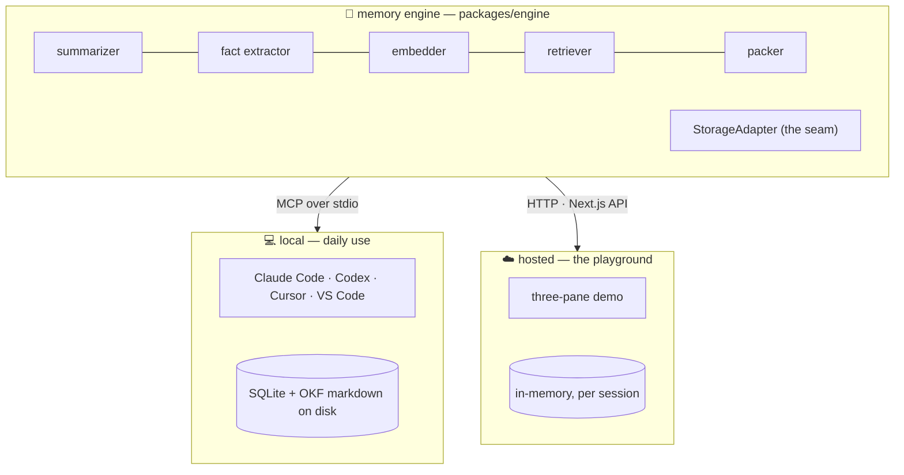

# CtxVault 🔁

**The handoff button for your AI tools.**

You're deep in a task with Claude Code. You hit your usage limit. You open Codex,
type *"resume"* — and it already knows your goal, your decisions, what's half-done,
and what to do next. No copy-paste. No re-explaining. That's CtxVault.

<!-- After deploying, fill these in — they are submission gates: -->
> 🔗 **Live playground:** [ctxvault.madebyshubham.in](https://ctxvault.madebyshubham.in/) &nbsp;·&nbsp; 🎥 **3-min demo:** _add your video link_

---

## The problem

Every AI coding tool forgets everything the moment you leave it.

You plan a feature in one tool → hit a limit or want a different model → switch
tools → the new one knows **nothing**. So you paste a wall of transcript and hope.
And every tool keeps its own private memory, in its own format, in its own silo —
none of it readable, portable, or yours.

## What CtxVault does

CtxVault is a **shared memory layer that sits between your AI tools**. Any
MCP-capable tool can talk to it. It gives them all the same brain:

```
save_context     → summarize this session into a structured handoff + extract facts
resume_context   → give me everything I need to continue, within a token budget
search_memory    → what did we decide about X? (searches by meaning, not keywords)
list_facts       → show me what this project "knows"
list_sessions    → what threads of work are saved?
```

Everything lives **on your machine**: one SQLite file + a folder of plain markdown.
No cloud, no account, no server to run. Delete the folder and the memory is gone —
it's yours.

## Why it's different

| | CtxVault | Cloud memory services | Each tool's built-in memory |
|---|---|---|---|
| Live handoff **between different tools** | ✅ the whole point | ❌ | ❌ locked to one tool |
| Where memory lives | your disk | someone's cloud | your disk, but siloed |
| Can you read/edit/git it? | ✅ plain markdown | rarely | partially |
| Setup needed | `npm run build` | account + API | none |

Nobody else does live *session* handoff across tools — and nobody stores agent
memory in files you can just open, grep, and commit.

## ✨ The OKF part (our favorite bit)

Durable knowledge isn't buried in a database — every fact CtxVault learns is
written as a markdown file in **OKF (Open Knowledge Format)**, an open,
frontmatter-based knowledge format from Google's research on portable agent
memory. One fact, one file:

```markdown
---
type: decision
title: Use Intl.DateTimeFormat for timezone display
tags: [timezone, intl-api]
---
Chose Intl.DateTimeFormat over date-fns/moment — native, cross-browser,
zero dependencies.
```

What using OKF bought us, concretely:

- **Readable without CtxVault.** Any human — or any other agent — can `cat` the
  memory. Your project's knowledge outlives the tool that wrote it.
- **Git-friendly.** Facts diff cleanly, get code-reviewed, travel with the repo.
- **Editable.** Wrong fact? Open the file, fix it. Try that with a vector DB.
- **A shelf, not a black box.** Decisions (`type: decision`), conventions,
  gotchas — each typed and tagged, so `list_facts` reads like a project wiki
  that wrote itself.

Find yours in `~/.ctxvault/knowledge/<project>/*.md`.

---

## Quick start

```bash
git clone <this repo> && cd ctxvault
npm install
npm run build        # builds the engine + MCP server → apps/mcp-server/dist/index.js
```

Grab the absolute path — every install below needs it:

```bash
echo "$(pwd)/apps/mcp-server/dist/index.js"
```

(Wherever you see `<PATH>` below, paste that.)

### Try the playground first (optional)

```bash
npm run playground    # → http://localhost:3111
```

Three panes: Tool A, the Vault, Tool B. Plan something in A, hit **Save context**,
**Resume in Tool B**, then search for a decision. Works without any API key
(degraded demo mode); add a key for real summaries — see
[docs/PLAYGROUND.md](docs/PLAYGROUND.md).

---

## Install as an MCP server

### Claude Code

```bash
claude mcp add ctxvault -s user \
  -e CTXVAULT_MODEL=anthropic:claude-haiku-4-5 \
  -e CTXVAULT_EMBED_MODEL=openai:text-embedding-3-small \
  -e ANTHROPIC_API_KEY=sk-ant-... \
  -e OPENAI_API_KEY=sk-... \
  -- node <PATH>
```

Then `/mcp` inside Claude Code should list `ctxvault` with 5 tools.

### Codex

Add to `~/.codex/config.toml`:

```toml
[mcp_servers.ctxvault]
command = "node"
args = ["<PATH>"]

[mcp_servers.ctxvault.env]
CTXVAULT_MODEL = "anthropic:claude-haiku-4-5"
CTXVAULT_EMBED_MODEL = "openai:text-embedding-3-small"
ANTHROPIC_API_KEY = "sk-ant-..."
OPENAI_API_KEY = "sk-..."
```

### Cursor

Add to `~/.cursor/mcp.json` (or `.cursor/mcp.json` in a project):

```json
{
  "mcpServers": {
    "ctxvault": {
      "command": "node",
      "args": ["<PATH>"],
      "env": {
        "CTXVAULT_MODEL": "anthropic:claude-haiku-4-5",
        "CTXVAULT_EMBED_MODEL": "openai:text-embedding-3-small",
        "ANTHROPIC_API_KEY": "sk-ant-...",
        "OPENAI_API_KEY": "sk-..."
      }
    }
  }
}
```

### VS Code

Add to `.vscode/mcp.json` in your workspace (note: VS Code uses `servers`, not
`mcpServers`):

```json
{
  "servers": {
    "ctxvault": {
      "type": "stdio",
      "command": "node",
      "args": ["<PATH>"],
      "env": {
        "CTXVAULT_MODEL": "anthropic:claude-haiku-4-5",
        "CTXVAULT_EMBED_MODEL": "openai:text-embedding-3-small",
        "ANTHROPIC_API_KEY": "sk-ant-...",
        "OPENAI_API_KEY": "sk-..."
      }
    }
  }
}
```

> ⚠️ **Keys go in the client's `env` block, not a `.env` file.** The MCP server is
> spawned by your editor/CLI and only sees the environment it's handed — a `.env`
> in the repo root is ignored. Full details, zero-cost setups, and a
> troubleshooting table: [docs/REGISTER.md](docs/REGISTER.md).

All tools share one vault at `~/.ctxvault/` — that's exactly what makes the
handoff work.

### Try the handoff

1. In **Claude Code**: do some work, then say
   *"save this to ctxvault under project myapp"*
2. In **Codex** (or Cursor, or VS Code): say
   *"resume project myapp from ctxvault"*

Tool #2 continues where tool #1 stopped. They never talked to each other — they
just share the vault.

---

## Pick any model (or none)

Every model call goes through the [Vercel AI SDK](https://sdk.vercel.ai), so the
model is a config string, not a code change:

```bash
CTXVAULT_MODEL=anthropic:claude-haiku-4-5        # fast + cheap, great default
CTXVAULT_MODEL=openai:gpt-5.1
CTXVAULT_MODEL=openrouter:<any-model>            # one key, hundreds of models
CTXVAULT_MODEL=compatible:llama3.1               # anything OpenAI-shaped (Ollama, Groq…)
```

**Runs free:** one OpenRouter free-tier key covers chat *and* embeddings — or go
fully offline with Ollama and no key at all:

```bash
# one free key
CTXVAULT_MODEL=openrouter:<free-model>   CTXVAULT_EMBED_MODEL=openrouter:openai/text-embedding-3-small

# no key, no network
CTXVAULT_MODEL=compatible:llama3.1       CTXVAULT_EMBED_MODEL=compatible:nomic-embed-text
CTXVAULT_BASE_URL=http://localhost:11434/v1
```

Pick a model that supports **structured outputs** — the summarizer constrains the
model to a schema, and one that can't honour it falls back to raw storage.

**No key at all?** Nothing breaks. Saves store raw text, search falls back to a
local word-match embedder. Never a dead button.

Embeddings are configured separately (`CTXVAULT_EMBED_MODEL`, default
`openai:text-embedding-3-small`) because Anthropic has no embeddings API.

---

## How it works

One engine, two front doors. The memory brain never knows how it's being called:



### Three tiers of memory

| Tier | What | Stored as | Answers |
|---|---|---|---|
| **working** | recent verbatim messages | raw snapshot | "what was just said" |
| **episodic** | a structured **HandoffNote** per session | goal, decisions, todos, gotchas, next step | "where was I?" |
| **semantic** | durable **facts** | **OKF markdown** + vectors | "what does this project know?" |

**Save** = summarize → extract facts → embed everything.
**Resume** = pack a priority stack into a token budget: HandoffNote → knowledge
index → relevant facts → recent transcript tail. Lowest priority gets truncated
first.
**Search** = semantic lookup ranked by `0.6·similarity + 0.3·recency + 0.1·project`,
with a relevance floor so junk queries honestly return "no match" instead of weak
noise.

### The tricks that make it work

- **Schema-constrained summarization.** The summarizer hands the model a zod
  schema via `generateObject` — the model is *forced* into the HandoffNote shape,
  not politely asked. That's also why smaller/cheaper models work here.
- **~60× semantic compression.** A HandoffNote is a compressed brief of the whole
  session; that's what saves tokens on resume. The OKF files are a shelf, not a
  compressor — durable and auditable.
- **Graceful degradation everywhere.** Model error during save? You get raw
  storage and a warning, never a failed save. Durability first.

---

## Project layout

```
packages/engine     # the brain — transport-agnostic memory logic
  ├─ ai/            # provider seam (any model via the AI SDK)
  ├─ llm/           # summarizer + fact extractor (schema-constrained)
  ├─ embed/         # real embedders + local fallback
  ├─ okf/           # OKF markdown read/write
  ├─ storage/       # StorageAdapter: SQLite (local) · in-memory (hosted)
  ├─ retriever.ts   # similarity + recency ranking
  └─ engine.ts      # save / resume / search
apps/mcp-server     # local front door — stdio MCP server (5 tools)
apps/playground     # hosted front door — three-pane Next.js demo
docs/               # deep dives — start with CODE-TOUR.md
```

**Deep dives:** [DATA-FLOW.md](docs/DATA-FLOW.md) · [CODE-TOUR.md](docs/CODE-TOUR.md) ·
[SUMMARIZER.md](docs/SUMMARIZER.md) · [EMBEDDINGS.md](docs/EMBEDDINGS.md) ·
[OKF-FACTS.md](docs/OKF-FACTS.md) · [PLAYGROUND.md](docs/PLAYGROUND.md) ·
[REGISTER.md](docs/REGISTER.md)

<!-- Add a real capture here — it's a submission gate.
     Suggested: a GIF of Save → Vault fills → Resume in Tool B → Search. Drop it in docs/assets/. -->
> _📸 Screenshot / GIF placeholder — add `docs/assets/handoff.gif` after a live run._

## Roadmap

- OKF merge intelligence — today an updated fact overwrites only when the slug
  matches; contradicting facts can coexist until then (known, on the list)
- Auto-capture hooks (save without asking) · cloud sync & team vaults
- Encryption at rest · re-import hand-edited OKF files as authoritative memory

## Tech

TypeScript · npm workspaces · [MCP](https://modelcontextprotocol.io) SDK ·
better-sqlite3 · zod · gray-matter · Next.js · [Vercel AI SDK](https://sdk.vercel.ai).

---

_Built for a hackathon by someone who switched AI CLIs four times while building
it — CtxVault carried the context every time._
