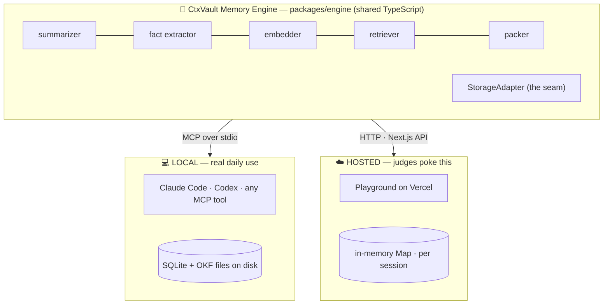

# CtxVault 🔁

**The handoff button for AI tools.** Start a task in Claude Code, hit your usage
limit, open Codex, type *resume* — your full working context is restored. No copy-
paste, no re-briefing. Local-first, zero-infra, works in any MCP tool. Durable
knowledge is stored as human-readable markdown in Google's **Open Knowledge Format
(OKF)**, so you — or any other agent — can read the memory without CtxVault running.

<!-- After deploying, fill these in — they are submission gates: -->
> 🔗 **Live playground:** _add your Vercel URL_ &nbsp;·&nbsp; 🎥 **3-min demo:** _add your video link_

---

## The problem (it's my own, four times a day)

Every AI coding tool has a memory that dies at its own doorstep. You plan a feature
in one tool, hit a usage limit or want a different model, switch tools — and the new
one knows *nothing*. You paste a wall of transcript and hope. Meanwhile each tool
hoards its own memory (`CLAUDE.md`, Codex config) in its own silo, in its own format,
that you can't read or move.

**CtxVault is the shared memory layer between tools.** One `save`, one `resume`, and
the context travels — as a compressed, structured handoff plus a folder of readable
knowledge files you own.

## Why it's different

The comparison table, up front, because it's the whole point:

| | Cross-tool **live handoff** | Storage | Human-readable / open format | Infra needed |
|---|:---:|---|:---:|:---:|
| **CtxVault** | ✅ **the point** | 1 SQLite file + OKF markdown | ✅ **OKF `.md` files** | none (local) |
| Mem0 / OpenMemory | ❌ long-term facts | cloud-first | partial | cloud account |
| Iranti | ❌ | Postgres | ❌ | Postgres |
| Native (`CLAUDE.md`, Codex memory) | ❌ siloed per tool | per-tool files | ✅ but siloed | none |

Nobody does live *session* handoff across tools, and nobody stores agent memory in an
**open standard** you can grep, edit, and git-commit. CtxVault does both.

---

## Architecture: one engine, two front doors

The entire memory brain lives in `packages/engine` and never knows how it's being
called. A thin transport wraps it — MCP over stdio locally, HTTP in the cloud. The
seam that makes this work is a single interface, `StorageAdapter`: SQLite on disk
locally, an in-memory `Map` on Vercel.



> *Same engine, only the transport differs.* Swap `SqliteAdapter` for `MemoryAdapter`
> and every line of memory logic — summarizer, embeddings, retrieval, OKF facts — runs
> unchanged. That interface is the unlock.

## The memory model (three tiers)

| Tier | What | Stored as | Answers |
|---|---|---|---|
| **working** | last ~10 verbatim messages | raw snapshot | "what was just said" |
| **episodic** | a structured **HandoffNote** per session | snapshot + JSON | "where was I, what's next" |
| **semantic** | durable **facts** | **OKF `.md` files** + vectors | "what does this project know" |

**SAVE** summarizes the session into a HandoffNote (goal, decisions, gotchas, next
step), extracts durable facts to OKF files, and embeds everything for search.
**RESUME** packs a priority stack within a token budget: HandoffNote → knowledge
index → relevant fact bodies → recent transcript. **SEARCH** does semantic lookup
over all of it.

---

## Quick start

```bash
git clone <this repo> && cd ctxvault
npm install          # builds the engine automatically
```

### Try the hosted playground locally

```bash
npm run playground   # → http://localhost:3111
```

Hit **💾 Save context**, watch the Vault fill with a HandoffNote and OKF facts, then
**🔁 Resume in Tool B**, then **🔍 search** for a decision. For real summaries add a
key (see [docs/PLAYGROUND.md](docs/PLAYGROUND.md)); without one it runs in demo mode.

### Use it for real — register the MCP server

Build once, then point your CLI at `apps/mcp-server/dist/index.js`.

**Claude Code:**
```bash
claude mcp add ctxvault -- node /ABS/PATH/ctxvault/apps/mcp-server/dist/index.js
# then inside Claude Code:  /mcp   → lists save_context, resume_context, search_memory, list_facts, list_sessions
```

**Codex** — add to `~/.codex/config.toml`:
```toml
[mcp_servers.ctxvault]
command = "node"
args = ["/ABS/PATH/ctxvault/apps/mcp-server/dist/index.js"]
```

Both tools share one vault at `~/.ctxvault/`, which is what makes the handoff work.
Full steps + the real-handoff demo: [docs/REGISTER.md](docs/REGISTER.md).

### Choosing a model

Every model call goes through the [Vercel AI SDK](https://sdk.vercel.ai), so the
provider is configuration, not code. Name a model as `<provider>:<model-id>` and
set that provider's key:

```bash
export CTXVAULT_MODEL=anthropic:claude-opus-4-8   # default
export ANTHROPIC_API_KEY=sk-ant-...

# or any of:
CTXVAULT_MODEL=openai:gpt-5.1                  OPENAI_API_KEY=...
CTXVAULT_MODEL=openrouter:google/gemini-3-pro  OPENROUTER_API_KEY=...   # one key, many models
CTXVAULT_MODEL=compatible:llama3.1             CTXVAULT_BASE_URL=http://localhost:11434/v1
```

`compatible:` covers anything that speaks the OpenAI wire format — Ollama, Groq,
Together, vLLM, LM Studio — with no extra dependency.

Embeddings are configured separately via `CTXVAULT_EMBED_MODEL` (default
`openai:text-embedding-3-small`), because Anthropic ships no embeddings endpoint.

**It runs free.** OpenRouter serves both chat and embeddings, so one free-tier key
covers the whole product — or go fully offline with Ollama and use no key at all:

```bash
# one key, nothing to install
CTXVAULT_MODEL=openrouter:<free-model>   CTXVAULT_EMBED_MODEL=openrouter:openai/text-embedding-3-small

# no key, no network
CTXVAULT_MODEL=compatible:llama3.1       CTXVAULT_EMBED_MODEL=compatible:nomic-embed-text
CTXVAULT_BASE_URL=http://localhost:11434/v1
```

Pick a model that supports **structured outputs** — the summarizer constrains the
model to a schema, and one that can't honour it falls back to raw storage. Setup,
caveats, and how to read the boot status line: [docs/REGISTER.md](docs/REGISTER.md).

Without any key, CtxVault degrades gracefully to raw storage and a local lexical
search — never a dead button.

<!-- Add a real capture here — it's a submission gate.
     Suggested: a GIF of Save → Vault fills → Resume in Tool B → Search. Drop it in docs/assets/. -->
> _📸 Screenshot / GIF placeholder — add `docs/assets/handoff.gif` after a live run._

---

## Techniques used, and why

CtxVault treats the model as the **engine**, not the skin:

- **Structured-output summarization.** The summarizer hands a **zod** schema to the
  provider as a native structured-output constraint (AI SDK `generateObject`), so the
  model is *constrained* to the `HandoffNote` shape rather than merely asked for it —
  and the result is re-validated before it's trusted. That's also what lets smaller,
  non-Claude models drive this path. ([SUMMARIZER.md](docs/SUMMARIZER.md))
- **Fact extraction → open-standard files.** A second prompt pulls *durable* knowledge
  (decisions, conventions, gotchas) and writes each as an OKF markdown file with
  frontmatter. Prompted hard to separate timeless facts from transient status.
  ([OKF-FACTS.md](docs/OKF-FACTS.md))
- **Embeddings + hybrid retrieval.** Semantic search over a configurable embedding model,
  ranked by a blend — `0.6·similarity + 0.3·recencyDecay(3d half-life) +
  0.1·sameProjectBoost` — so a fresh near-match can beat a stale exact match.
  ([EMBEDDINGS.md](docs/EMBEDDINGS.md))
- **Token budgeting.** `resume` builds a priority stack and truncates lowest-priority
  first, keeping the injected packet inside a token budget.
- **Graceful degradation.** No API key ⇒ raw storage + local hashing-based search.
  A model error during save ⇒ a warning, never a failed save. Durability first.

### The token model (judge-proof)

**Store everything** (cheap) → **retrieve little** (top-k) → **compress what you
inject** (a HandoffNote is ~60× semantic compression of a session) → **budget the
packet** (the packer). The OKF files are a **shelf, not a compressor** — durable,
auditable storage. We never claim the files save tokens; the *summary* does.

### Explored & rejected: optical / image compression

We considered image-based context compression (e.g. DeepSeek-OCR-style, ~10× on
tokens by rendering text to images). Rejected: it's **lossy and un-searchable**, and
CLIs inject **text**, not images — so it doesn't fit the handoff path. **Structured
summarization gives ~60× *semantic* compression** and stays searchable and human-
readable. Right tool for the job.

---

## Real-world use case: a lawyer's case files

Each case is a project; sessions become handoff notes; case facts become auditable,
editable local OKF files (confidentiality — nothing leaves the machine). A junior
types `resume case-smith` instead of being re-briefed. **Same code, different
namespace** — the engine doesn't care whether it's your side project or a law firm.

---

## Project layout

```
packages/engine   # the brain — memory logic + storage adapters (transport-agnostic)
  ├─ ai/          # provider seam — any model via the Vercel AI SDK
  ├─ llm/         # summarizer + fact extractor (schema-constrained via generateObject)
  ├─ embed/       # AI SDK + local-fallback embedders
  ├─ okf/         # Open Knowledge Format markdown files
  ├─ storage/     # StorageAdapter interface · SQLite impl · in-memory impl
  ├─ retriever.ts # similarity + recency ranking
  └─ engine.ts    # save / resume(packer) / search
apps/mcp-server   # LOCAL front door — stdio MCP server (5 tools)
apps/playground   # HOSTED front door — Next.js three-pane UI on Vercel
docs/             # a teaching doc per phase — start with CODE-TOUR.md
```

**Deep dives:** [DATA-FLOW.md](docs/DATA-FLOW.md) (how a request moves through the
system, with pointers) · [CODE-TOUR.md](docs/CODE-TOUR.md) (what every file does + quizzes) ·
[SUMMARIZER.md](docs/SUMMARIZER.md) · [EMBEDDINGS.md](docs/EMBEDDINGS.md) ·
[OKF-FACTS.md](docs/OKF-FACTS.md) · [PLAYGROUND.md](docs/PLAYGROUND.md) ·
[REGISTER.md](docs/REGISTER.md)

## Roadmap

- Cloud sync & team-shared vaults · auto-capture hooks (save without asking)
- OKF merge intelligence (today: same slug overwrites) · encryption at rest
- Re-import edited OKF files as authoritative memory

## Tech

TypeScript · npm workspaces · [MCP](https://modelcontextprotocol.io) SDK ·
better-sqlite3 · zod · gray-matter · Next.js · [Vercel AI SDK](https://sdk.vercel.ai)
(Anthropic · OpenAI · OpenRouter · any OpenAI-compatible server).

---

_Built for the Namaste Dev Hackathon. I switched CLIs four times building this —
CtxVault carried the context every time._
