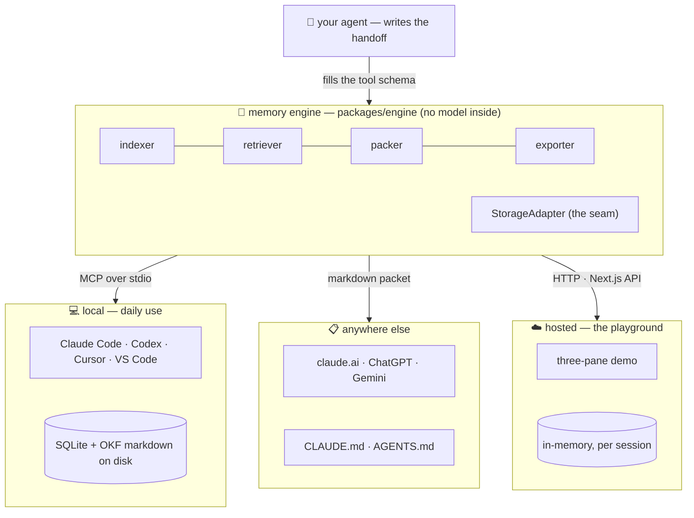

# CtxVault 🔁

**The handoff button for your AI tools.**

You're deep in a task with Claude Code. You hit your usage limit. You open Codex,
type *"resume"* — and it already knows your goal, your decisions, what's half-done,
and what to do next. No copy-paste. No re-explaining. That's CtxVault.

<!-- After deploying, fill these in — they are submission gates: -->
> 🔗 **Live playground:** [ctxvault.madebyshubham.in](https://ctxvault.madebyshubham.in/) &nbsp;·&nbsp; 🎥 **3-min demo:** _add your video link_

---

## The problem

Every AI coding tool forgets everything the moment you leave it.

You plan a feature in one tool → hit a limit or want a different model → switch
tools → the new one knows **nothing**. So you paste a wall of transcript and hope.
And every tool keeps its own private memory, in its own format, in its own silo —
none of it readable, portable, or yours.

## What CtxVault does

CtxVault is a **shared memory layer that sits between your AI tools**. Any
MCP-capable tool can talk to it. It gives them all the same brain:

```
save_context     → your agent writes a structured handoff + durable facts
resume_context   → give me everything I need to continue, within a token budget
export_context   → a paste-able packet for tools that don't speak MCP
search_memory    → what did we decide about X, across every past session?
list_facts       → show me what this project "knows"
list_sessions    → what threads of work are saved?
```

Everything lives **on your machine**: two folders of plain markdown plus a SQLite
index you can delete and rebuild. No cloud, no account, no server to run. Delete the
folder and the memory is gone — it's yours.

## Zero API keys

**CtxVault ships no model and calls no LLM.** Your agent already lived through the
session and already understands it, so it writes the handoff itself — the tool's
input schema *is* the form — using tokens you have already paid for. Search is
keyword-based (SQLite FTS5/BM25) and needs no key either.

That means installing CtxVault does not add an API bill, a rate limit, or a second
model to configure. `npm run build`, point your editor at it, done.

> Want semantic search too? Set one embedding model and search becomes hybrid
> (BM25 + vectors). It's an upgrade, not a requirement.

## Why it's different

| | CtxVault | Cloud memory services | Each tool's built-in memory |
|---|---|---|---|
| Live handoff **between different tools** | ✅ the whole point | ❌ | ❌ locked to one tool |
| Needs its own API key / budget | ❌ **none** | ✅ | ✅ (inside your plan) |
| Where memory lives | your disk | someone's cloud | your disk, but siloed |
| Can you read/edit/git it? | ✅ plain markdown | rarely | partially |
| Works with tools that lack MCP | ✅ via `export` | ❌ | ❌ |
| Setup needed | `npm run build` | account + API | none |

Nobody else does live *session* handoff across tools — and nobody stores agent
memory in files you can just open, grep, and commit.

## ✨ The OKF part (our favorite bit)

Durable knowledge isn't buried in a database — every fact CtxVault learns is
written as a markdown file in **OKF (Open Knowledge Format)**, an open,
frontmatter-based knowledge format from Google's research on portable agent
memory. One fact, one file:

```markdown
---
type: decision
title: Use Intl.DateTimeFormat for timezone display
tags: [timezone, intl-api]
---
Chose Intl.DateTimeFormat over date-fns/moment — native, cross-browser,
zero dependencies.
```

What using OKF bought us, concretely:

- **Readable without CtxVault.** Any human — or any other agent — can `cat` the
  memory. Your project's knowledge outlives the tool that wrote it.
- **Git-friendly.** Facts diff cleanly, get code-reviewed, travel with the repo.
- **Editable.** Wrong fact? Open the file, fix it. Try that with a vector DB.
- **A shelf, not a black box.** Decisions (`type: decision`), conventions,
  gotchas — each typed and tagged, so `list_facts` reads like a project wiki
  that wrote itself.

Find yours in `~/.ctxvault/knowledge/<project>/*.md`. Saved sessions get the same
treatment in `~/.ctxvault/handoffs/<project>/<session>/*.md` — structured note in the
frontmatter, transcript in the body. The database beside them is a **derived index**:
`rm ctxvault.db && ctx reindex` restores the whole vault from these files.

---

## Quick start

```bash
git clone <this repo> && cd ctxvault
npm install
npm run build        # builds the engine + MCP server → apps/mcp-server/dist/index.js
```

Grab the absolute path — every install below needs it:

```bash
echo "$(pwd)/apps/mcp-server/dist/index.js"
```

(Wherever you see `<PATH>` below, paste that.)

### Try the playground first (optional)

```bash
npm run playground    # → http://localhost:3111
```

Three panes: Tool A, the Vault, Tool B. Plan something in A, hit **Save context**,
**Resume in Tool B**, then search for a decision.

The playground needs a key for one thing only — *pretending to be your coding
agent*, since it has no real one to borrow. The vault itself (save, resume,
search, export) runs keyless here exactly as it does on your machine. See
[docs/PLAYGROUND.md](docs/PLAYGROUND.md).

---

## Install as an MCP server

### Claude Code

```bash
claude mcp add ctxvault -s user -- node <PATH>
```

Then `/mcp` inside Claude Code should list `ctxvault` with 6 tools.

### Codex

Add to `~/.codex/config.toml`:

```toml
[mcp_servers.ctxvault]
command = "node"
args = ["<PATH>"]
```

### Cursor

Add to `~/.cursor/mcp.json` (or `.cursor/mcp.json` in a project):

```json
{
  "mcpServers": {
    "ctxvault": {
      "command": "node",
      "args": ["<PATH>"]
    }
  }
}
```

### VS Code

Add to `.vscode/mcp.json` in your workspace (note: VS Code uses `servers`, not
`mcpServers`):

```json
{
  "servers": {
    "ctxvault": {
      "type": "stdio",
      "command": "node",
      "args": ["<PATH>"]
    }
  }
}
```

> No `env` block anywhere — that's the point. If you later add an embedding model
> for hybrid search, its key goes in the client's `env` (the MCP server only sees
> the environment its client hands it; a repo `.env` is ignored). Details:
> [docs/REGISTER.md](docs/REGISTER.md).

All tools share one vault at `~/.ctxvault/` — that's exactly what makes the
handoff work.

### Try the handoff

1. In **Claude Code**: do some work, then say
   *"save this to ctxvault under project myapp"*
2. In **Codex** (or Cursor, or VS Code): say
   *"resume project myapp from ctxvault"*

Tool #2 continues where tool #1 stopped. They never talked to each other — they
just share the vault.

---

## Take it anywhere — even to tools without MCP

Not every tool speaks MCP, and you shouldn't have to care. `export_context`
renders the same packet as plain markdown:

```bash
ctx export | pbcopy          # paste into claude.ai, ChatGPT, Gemini, anywhere
ctx export --to claude       # write a block into CLAUDE.md
ctx export --to agents       # …or AGENTS.md, for Codex
ctx search "argon2"          # query the vault from a terminal
ctx list                     # what does this project know?
```

The `--to claude` / `--to agents` block lives between markers and is **replaced**
on every export, never appended — so those files stay a small current-state card
instead of growing forever. Everything outside the markers is left untouched.

## One vault, every machine — on your own git remote

"Continue anywhere" usually means someone else runs a sync service and holds your
memory. It doesn't have to. The vault is already a folder of markdown, so:

```bash
ctx sync init git@github.com:you/my-vault.git   # a private repo you own
ctx sync                                        # commit · pull --rebase · push
```

Laptop, desktop, Codespaces, a teammate — same memory, no account, no server, no
one else's disk. The `.db` is **not** synced: it's a derived index, and
`ctx reindex` rebuilds it from the markdown on the other side. Delete the
database entirely and the vault comes back intact — that's the invariant.

Conflicts stay rare by design: one file per fact, and handoffs are append-only.
When one does happen, it's a markdown file you can just open and fix.

## Not another bloated CLAUDE.md

The advice going around is "keep CLAUDE.md minimal, it's poisoning your context."
That advice is right, and it's the problem CtxVault is built around.

CLAUDE.md is loaded **in full, every session, relevant or not** — with no budget,
no ranking, and nothing that ever expires. CtxVault inverts all three:

| | CLAUDE.md | CtxVault |
|---|---|---|
| Holds | permanent rules ("run tests with X") | working state + what the project learned |
| Loaded | always, entirely | on demand, ranked, inside a token budget |
| Expiry | never — it only accumulates | newest handoff wins; same-slug facts update in place; ranking decays with age |
| Cost of a long history | grows every context window | flat — the search runs in SQLite, not in your context |

Memory is unlimited. What enters the context window is not.

## Search: free by default, better if you want

Keyword search (SQLite **FTS5 / BM25**) is always on — no key, no network, no
model download. On this corpus it's genuinely strong: a few hundred short,
titled, tagged notes full of distinctive technical terms is exactly what BM25 is
good at, and the calling agent can re-query with different words when the first
try misses.

Add an embedding model and search becomes **hybrid** — keyword and vector results
are merged, and a document both halves agree on ranks highest:

```bash
CTXVAULT_EMBED_MODEL=openai:text-embedding-3-small     # or openrouter:…, or a
CTXVAULT_EMBED_MODEL=compatible:nomic-embed-text       # local Ollama, no key
CTXVAULT_BASE_URL=http://localhost:11434/v1
```

We don't claim BM25 beats embeddings — hybrid ranks best, and vectors catch
paraphrases keywords miss ("date formatting library" → a note that says
`Intl.DateTimeFormat`). We claim keyword is the right *default*, because a
default that costs money is a default most people never turn on.

---

## How it works

One engine, two front doors. The memory brain never knows how it's being called:



### Three tiers of memory

| Tier | What | Stored as | Answers |
|---|---|---|---|
| **working** | recent verbatim messages | raw snapshot | "what was just said" |
| **episodic** | a structured **HandoffNote** per session | goal, decisions, todos, gotchas, next step | "where was I?" |
| **semantic** | durable **facts** | **OKF markdown** + search index | "what does this project know?" |

**Save** = the agent hands over a HandoffNote + facts → validate → write OKF files
→ index. No model call, no network.
**Resume** = pack a priority stack into a token budget: HandoffNote → knowledge
index → relevant facts → recent transcript tail. Lowest priority gets truncated
first.
**Search** = BM25 (+ cosine when configured), blended with a 3-day recency
half-life, with a relevance floor so junk queries honestly return "no match"
instead of weak noise.

### The tricks that make it work

- **The tool schema is the prompt.** `save_context` advertises the HandoffNote
  shape with a `.describe()` on every field, so the calling agent is *constrained*
  into the right structure rather than politely asked for a summary — the same
  trick as schema-constrained generation, minus our model.
- **Whoever already knows, writes.** The agent that lived through the session
  summarizes it. Better source material than a second model reading a transcript,
  and it costs the user nothing extra.
- **Markdown is the truth, SQLite is an index.** Facts are real files you can
  read, edit, grep and commit; the database can be rebuilt from them (`ctx
  reindex`). That's what makes syncing a vault as simple as syncing a folder.
- **Graceful degradation everywhere.** No handoff supplied? Raw storage. No
  embedding key? Keyword search. FTS5 missing from your SQLite build? The same
  BM25 in JavaScript. Never a dead button.

---

## Project layout

```
packages/engine     # the brain — transport-agnostic, and model-free
  ├─ ai/            # provider seam (optional embedders, via the AI SDK)
  ├─ embed/         # embedder interface + implementation (optional upgrade)
  ├─ export/        # CLAUDE.md / AGENTS.md block writer (bounded, replaceable)
  ├─ okf/           # OKF fact files + handoff files (the source of truth)
  ├─ storage/       # StorageAdapter: SQLite+FTS5 (local) · in-memory (hosted)
  ├─ lib/text.ts    # FTS query building + a BM25 fallback
  ├─ retriever.ts   # hybrid blend: keyword + vector + recency
  └─ engine.ts      # save / resume / search / export
apps/mcp-server     # local front door — stdio MCP server (6 tools) + the `ctx` CLI
  └─ sync.ts        # vault over your own git remote
apps/playground     # hosted front door — three-pane Next.js demo
docs/               # deep dives — start with CODE-TOUR.md
```

**Deep dives:** [DATA-FLOW.md](docs/DATA-FLOW.md) · [CODE-TOUR.md](docs/CODE-TOUR.md) ·
[HANDOFF.md](docs/HANDOFF.md) · [SEARCH.md](docs/SEARCH.md) ·
[OKF-FACTS.md](docs/OKF-FACTS.md) · [PLAYGROUND.md](docs/PLAYGROUND.md) ·
[REGISTER.md](docs/REGISTER.md) · [PLAN-V2.md](docs/PLAN-V2.md)

<!-- Add a real capture here — it's a submission gate.
     Suggested: a GIF of Save → Vault fills → Resume in Tool B → Search. Drop it in docs/assets/. -->
> _📸 Screenshot / GIF placeholder — add `docs/assets/handoff.gif` after a live run._

## Roadmap

- OKF merge intelligence — today an updated fact overwrites only when the slug
  matches; contradicting facts can coexist until then (known, on the list)
- Auto-capture hooks (save without asking)
- Encryption at rest · re-import hand-edited OKF files as authoritative memory

## Tech

TypeScript · npm workspaces · [MCP](https://modelcontextprotocol.io) SDK ·
better-sqlite3 (+ FTS5) · zod · gray-matter · Next.js. The
[Vercel AI SDK](https://sdk.vercel.ai) appears only on the optional embedding
path and in the playground's simulated agent — never in the core save/resume flow.

---

_Built for a hackathon by someone who switched AI CLIs four times while building
it — CtxVault carried the context every time._
