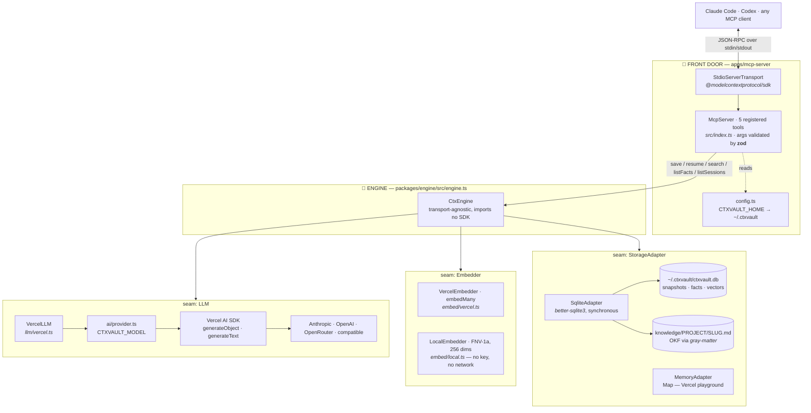
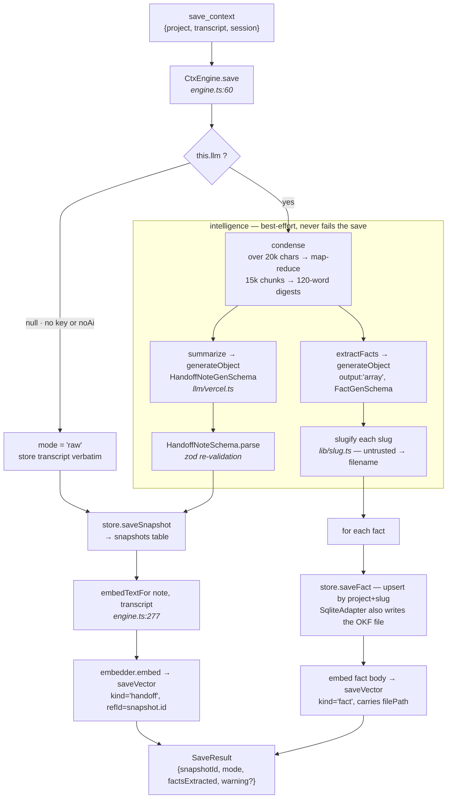
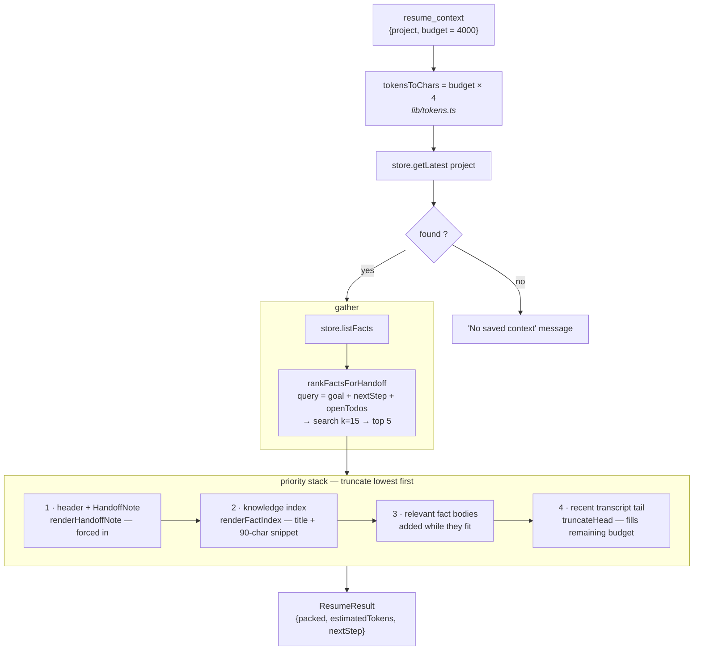
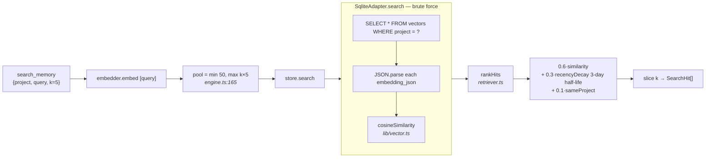

# Data flow — how a request moves through CtxVault

Every box below names the **file, function, and library** that actually does the
work. Read this alongside [CODE-TOUR.md](CODE-TOUR.md), which walks the tree;
this doc walks the *data*.

---

## 1. The whole picture

**The seams are the design.** `CtxEngine` depends on three interfaces —
`LLM`, `Embedder`, `StorageAdapter` — and never on a concrete provider. That's
what lets the same engine run over stdio locally and HTTP on Vercel, and what
makes `--no-ai` a graceful degrade instead of a dead button.

---

## 2. SAVE — transcript in, memory out

**Pointers per box**

| Box | Where | Notes |
|---|---|---|
| map-reduce | `llm/vercel.ts` | threshold 20k chars, `CHUNK_SIZE` 15k, digests capped at 400 output tokens |
| structured output | `ai` v7 `generateObject` | the zod schema is a **native provider constraint**, not a prompt request |
| schema re-validation | `types.ts` | `HandoffNoteSchema` / `FactsArraySchema` — the model's output is never trusted raw |
| snapshot row | `storage/sqlite.ts` | `snapshots(id, project, session, created_at, raw_transcript, handoff_json)` |
| fact upsert | `storage/sqlite.ts` | PK `(project, slug)` — same slug **overwrites**, no merge |
| OKF file | `okf/okf.ts` | `matter.stringify` → frontmatter + body |
| vector row | `storage/sqlite.ts` | embedding stored as **JSON text**, not a blob |

> Every intelligence step is wrapped in `try/catch` and pushes to `warnings[]`.
> A model outage degrades to `mode: "raw"` — the save itself always succeeds.

---

## 3. RESUME — the priority stack

Priorities 1 and 2 are small and high-signal, so they go in whole. 3 and 4
compete for whatever budget is left — which is why the token estimate
(`chars / 4`) matters, and why it runs optimistic on code-heavy text.

---

## 4. SEARCH — retrieval and ranking

Two things worth knowing about this path:

- **No ANN index.** Every query loads and scans every vector in the project.
  Fine at hundreds of vectors, and honest about it — but it's a linear scan.
- **Recency is a first-class ranking signal.** A fresh near-match beats a stale
  exact match by design; the 3-day half-life never zeroes an old memory out.

---

## 5. The five MCP tools

| Tool | Engine call | Returns |
|---|---|---|
| `save_context` | `engine.save` | snapshot id, mode, fact count, any warning |
| `resume_context` | `engine.resume` | the packed context block |
| `search_memory` | `engine.search` | ranked hits with score + file path |
| `list_facts` | `engine.listFacts` | every OKF fact for a project |
| `list_sessions` | `engine.listSessions` | sessions + snapshot counts |

Tool *descriptions* are written as prompts — they tell the calling model **when**
to reach for the tool, in its own decision-making language. That text is part of
the product, not documentation.

> ⚠️ **Golden rule** (`apps/mcp-server/src/index.ts`): the transport owns stdout.
> Every log goes to **stderr** via `console.error`. One stray `console.log`
> corrupts the JSON-RPC stream and the client silently drops the server.

---

## 6. Configuration — what changes behaviour

| Variable | Default | Effect |
|---|---|---|
| `CTXVAULT_MODEL` | `anthropic:claude-opus-4-8` | `<provider>:<model-id>` — anthropic, openai, openrouter, compatible |
| `CTXVAULT_EMBED_MODEL` | `openai:text-embedding-3-small` | separate, because Anthropic has no embeddings endpoint |
| `CTXVAULT_BASE_URL` | — | required by `compatible:` — Ollama, Groq, vLLM, LM Studio |
| `CTXVAULT_HOME` | `~/.ctxvault` | DB + knowledge dir location |
| `CTXVAULT_NO_AI` / `--no-ai` | off | forces raw storage + LocalEmbedder |

Resolution lives in `ai/provider.ts`; `hasApiKey` decides on-vs-off, and
`canEmbed` is stricter — it also rejects providers with no embeddings API.

---

## 7. Known lossy edges

Being explicit about where fidelity is spent, since this is memory software:

1. **The raw transcript is stored but not indexed** when a HandoffNote exists —
   `embedTextFor` prefers the note. Anything the summarizer dropped is
   unreachable by search.
2. **Fact-body packing stops at the first fact that doesn't fit**
   (`break`, not `continue`) — one large fact can block smaller ones behind it.
3. **`condense` runs twice** for >20k transcripts — once in `summarize`, once in
   `extractFacts` — so the note and the facts derive from independent digests.
4. **Resume reads only `getLatest`** — earlier snapshots in the same session
   contribute nothing unless their content became a durable fact.
5. **Facts overwrite on slug collision** with no merge, so an evolving fact loses
   its prior nuance.
