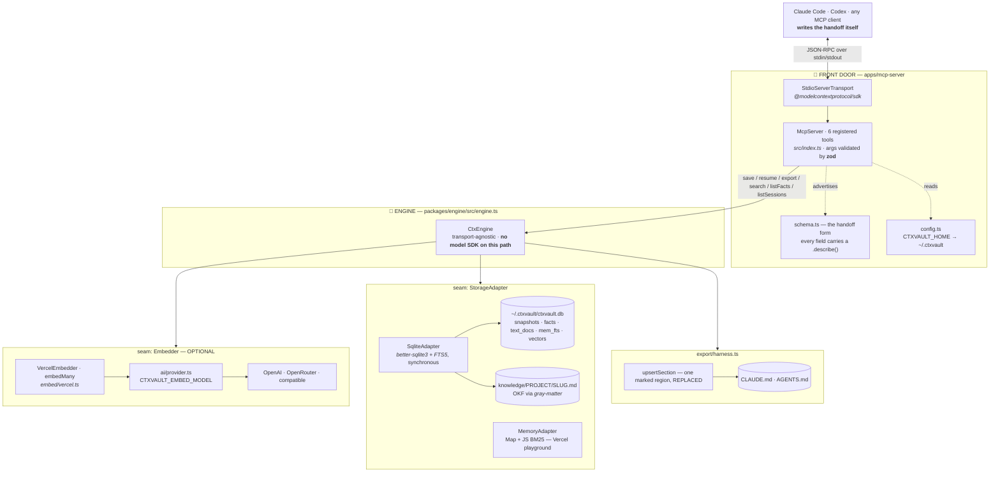
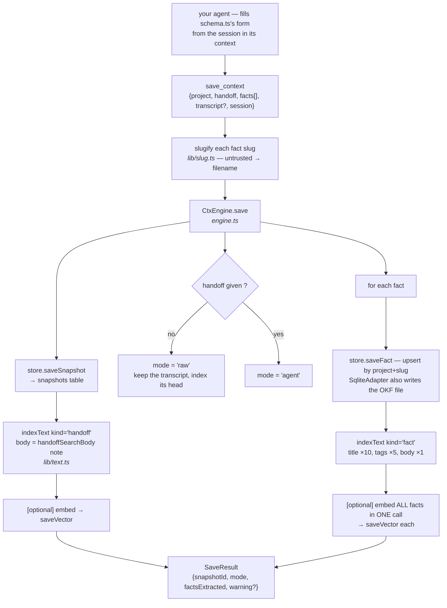
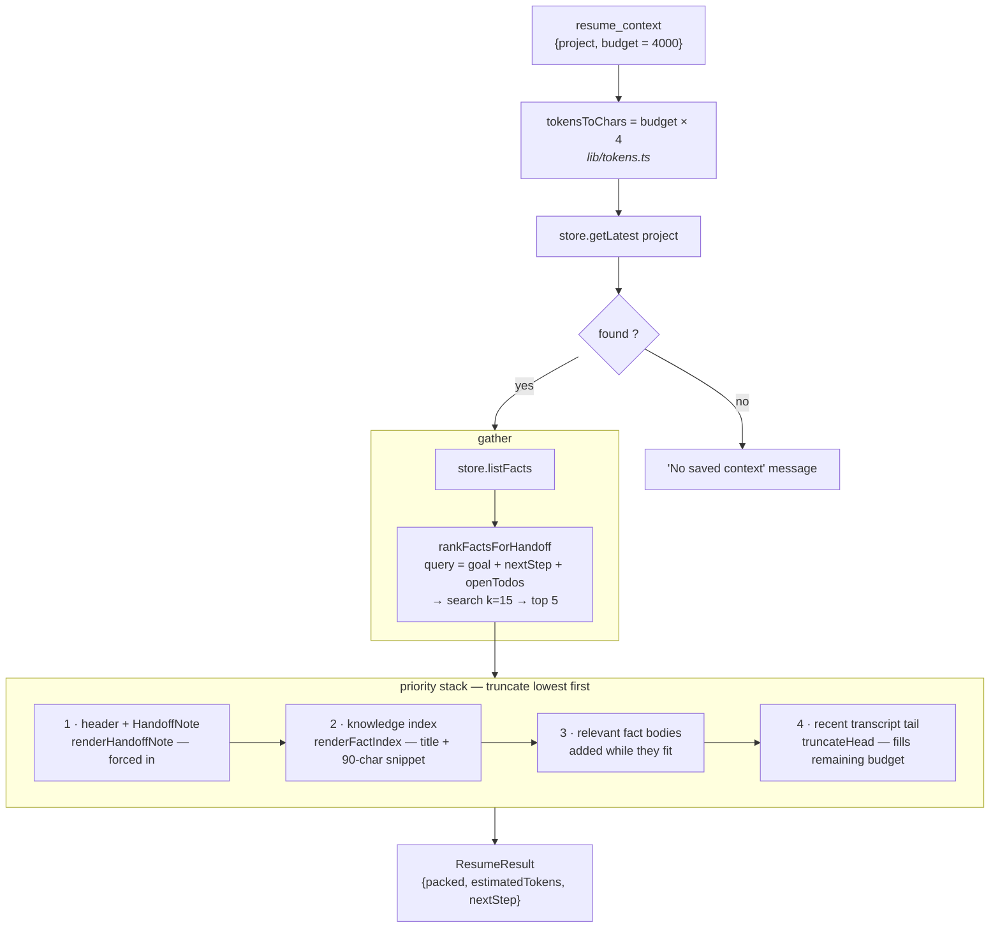
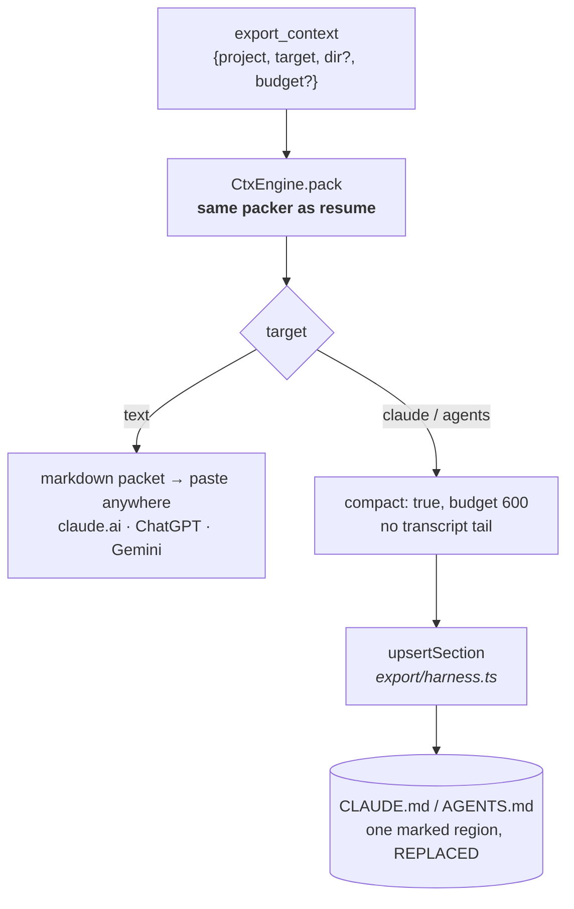
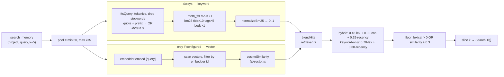

# Data flow — how a request moves through CtxVault

Every box below names the **file, function, and library** that actually does the
work. Read this alongside [CODE-TOUR.md](CODE-TOUR.md), which walks the tree;
this doc walks the *data*.

---

## 1. The whole picture

**The seams are the design.** `CtxEngine` depends on two interfaces —
`Embedder` and `StorageAdapter` — and never on a concrete provider. That's what
lets the same engine run over stdio locally and HTTP on Vercel.

**Note what's missing: there is no LLM seam.** It was deleted in v2. The
intelligence now sits *above* the front door, in the calling agent, which is why
the top box says "writes the handoff itself."

---

## 2. SAVE — a filled-in form in, memory out

**Pointers per box**

| Box | Where | Notes |
|---|---|---|
| the form | `apps/mcp-server/src/schema.ts` | `.describe()` text is the only instruction the agent gets — treat it as a prompt |
| constrained output | MCP `inputSchema` | tool args are schema-constrained by the *client's* model, the same mechanism `generateObject` used |
| validation | `types.ts` | `HandoffNoteSchema` / `FactSchema` — input from a model is never trusted raw |
| snapshot row | `storage/sqlite.ts` | `snapshots(id, project, session, created_at, raw_transcript, handoff_json)` |
| fact upsert | `storage/sqlite.ts` | PK `(project, slug)` — same slug **overwrites**, no merge |
| OKF file | `okf/okf.ts` | `matter.stringify` → frontmatter + body |
| keyword index | `storage/sqlite.ts` | `text_docs` (durable) + `mem_fts` (FTS5). No upsert in FTS5 → delete-then-insert in one transaction |
| vector row | `storage/sqlite.ts` | embedding stored as **JSON text**, not a blob |

> Indexing is best-effort and wrapped in `try/catch` → `warnings[]`. A failed index
> costs discoverability; the saved context itself always survives.
>
> **No network call happens anywhere in this diagram** unless an embedder is configured.

---

## 3. RESUME — the priority stack

Priorities 1 and 2 are small and high-signal, so they go in whole. 3 and 4
compete for whatever budget is left — which is why the token estimate
(`chars / 4`) matters, and why it runs optimistic on code-heavy text.

`rankFactsForHandoff` now works **without an embedder**, since keyword search is
always available — so resume is fully ranked on a keyless install.

---

## 4. EXPORT — the same packet, addressed elsewhere

One packer serves both `resume` and `export`, so the MCP path and the paste path
can't drift on what "enough context to continue" means.

The file target is bounded **by construction**: a single marked region that is
replaced on every write, never appended, with everything outside it preserved byte
for byte. The vault grows; that file must not — otherwise CtxVault would recreate
the always-loaded-context problem it exists to solve.

---

## 5. SEARCH — two indexes, one ranking

Three things worth knowing about this path:

- **The scan happens in SQLite, not in the context window.** Search cost in tokens
  is flat regardless of how much history the vault holds.
- **Both halves are best-effort.** If embeddings fail, keyword results still
  answer. "Search is only lexical today" beats "search is down."
- **The floor is honesty.** Without it, top-k returns *something* for any query,
  and a weak hit presented as a result reads as an answer.

Full detail: [SEARCH.md](SEARCH.md).

---

## 6. The six MCP tools

| Tool | Engine call | Returns |
|---|---|---|
| `save_context` | `engine.save` | snapshot id, mode, fact count, any warning |
| `resume_context` | `engine.resume` | the packed context block |
| `export_context` | `engine.exportPacket` | paste-able packet, or a written file path |
| `search_memory` | `engine.search` | ranked hits with score + file path |
| `list_facts` | `engine.listFacts` | every OKF fact for a project |
| `list_sessions` | `engine.listSessions` | sessions + snapshot counts |

Tool *descriptions* are written as prompts — they tell the calling model **when**
to reach for the tool, in its own decision-making language. Since v2 they also
carry the instruction that the agent writes the summary itself. That text is part
of the product, not documentation.

> ⚠️ **Golden rule** (`apps/mcp-server/src/index.ts`): the transport owns stdout.
> Every log goes to **stderr** via `console.error`. One stray `console.log`
> corrupts the JSON-RPC stream and the client silently drops the server.

---

## 7. Configuration — what changes behaviour

| Variable | Default | Effect |
|---|---|---|
| `CTXVAULT_EMBED_MODEL` | *(unset)* | set it to upgrade search from keyword to hybrid |
| `CTXVAULT_BASE_URL` | — | required by `compatible:` — Ollama, Groq, vLLM, LM Studio |
| `CTXVAULT_HOME` | `~/.ctxvault` | DB + knowledge dir location |

That's the whole table now. There is no model to choose and no key to supply for
the core flow — `canEmbed` in `ai/provider.ts` decides only whether search is
hybrid, and it is stricter than a key check (it also rejects providers with no
embeddings API, like Anthropic).

---

## 8. Known lossy edges

Being explicit about where fidelity is spent, since this is memory software:

1. **The raw transcript is stored but not indexed** when a HandoffNote exists —
   `handoffSearchBody` prefers the note. Anything the agent left out of the
   handoff is unreachable by search.
2. **Fact-body packing stops at the first fact that doesn't fit**
   (`break`, not `continue`) — one large fact can block smaller ones behind it.
3. **Resume reads only `getLatest`** — earlier snapshots in the same session
   contribute nothing unless their content became a durable fact.
4. **Facts overwrite on slug collision** with no merge, so an evolving fact loses
   its prior nuance.
5. **Handoff quality is now the agent's responsibility.** A lazy agent writes a
   lazy handoff, and CtxVault has no way to tell — it can validate the shape, not
   the substance. The mitigation is entirely in `schema.ts`'s field descriptions.
